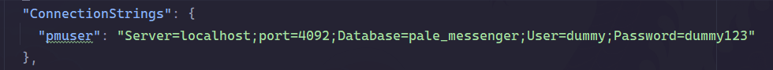
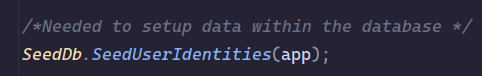
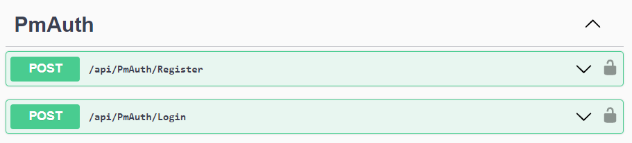

# Pmbackend

This repo is the backend used for the application the PaleMessenger.

## Setup
To setup the project a couple of things are needed:
- A MySQL database (in this case we will use MariaDB to do the setup).
- ASP.NET Core 6
  - EntityFramework
  - SignalR
  - Pomelo DB (Used for the MYSQL database injection)

The ASP.NET core libraries necessary are already included within the project through 
nuget packages, but in the case that these aren't present these packages are necessary.

A database will have to be setup, preferably named 'pale_messenger'
To use the database after adding it you will have to setup the connection string in 
the applications.json file (see below).

`CREATE DATABASE pale_messenger`
It is good practice to create a user for the database so that root access to the 
database can be avoided.

Within the string you will have to enter your own credentials to login into the 
database locally, it isn't hosted on anything.

The database will be empty but the application has a seed function to add data to the 
database. See below

By running the code it will then seed the database. 

## IMPORTANT
It is very important to update the database so that the tables can be integrated into 
the mysql database. After that the database can be seeded.
`update-database` will be the command to update the database, you will have to input 
this in the PackageManager console in the dir "~/pmbackend/pmbackend".

If you are not using Visual Studio then you will have to use:
`dotnet ef database update` in the terminal instead to update the database through the 
EntityFramework schemas created in the migrations folder. It will always try to update 
the database with the most recent migration within the folder.

# How to use
The application has a swagger doc where all of the API calls can be done.
It is very important to use the login call of the PmAuth controller.

After that a JWT will be created in the response body, you can use either the login or 
register to get a JWT. It is recommended to use the already available credentials 
which can be found in the SeedDB function.
This JWT you will have to enter inside of the authorize tab of swagger.
After that you can use all of the API, test some things and see their results.

